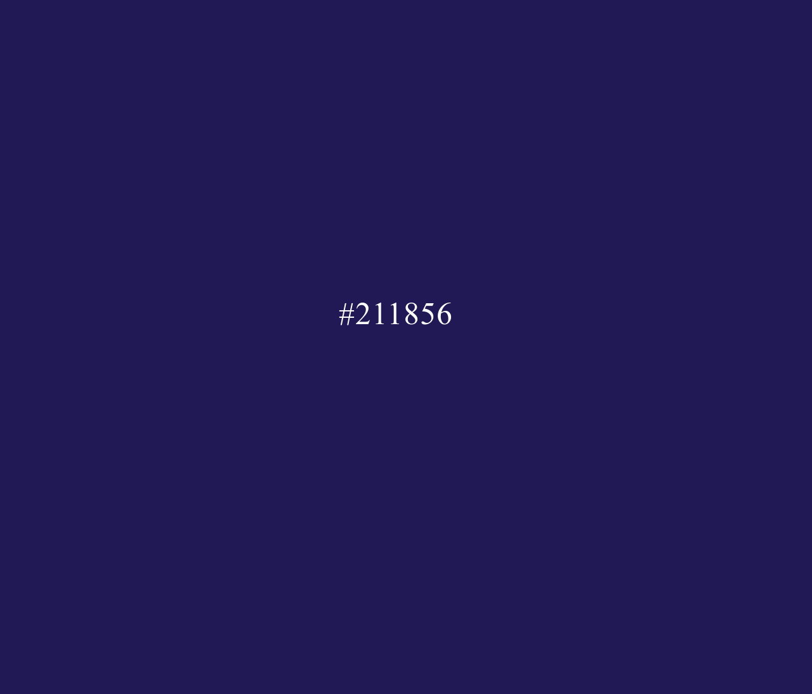

# Hexadecimal Clock

This project displays a real-time clock where the current time is represented in hexadecimal format. The background colour of the webpage updates every second to match the hexadecimal value of the current time, making the whole display change colour over time. The time is also displayed in the centre of the page.

## Features
- **Real-Time Clock**: The clock updates every second to show the current time in the format `#hhmmss`.
- **Dynamic Background**: The background colour changes based on the current time in hexadecimal format, creating a visually appealing effect.

## Files
- **index.html**: This is the main HTML file that includes the basic structure for the project.
- **style.css**: This file contains the styles used to centre the hexadecimal clock and make it visually appealing.
- **index.js**: This JavaScript file uses jQuery to dynamically update the background colour and the displayed time every second.

## Technologies Used
- **HTML5**: For the structure of the webpage.
- **CSS3**: To style the page, including centring the time display and setting the font.
- **JavaScript**: To calculate the current time and update the page accordingly.
- **jQuery**: To simplify DOM manipulation.

## Screenshot

## License
This project is open-source and available under the MIT License.

